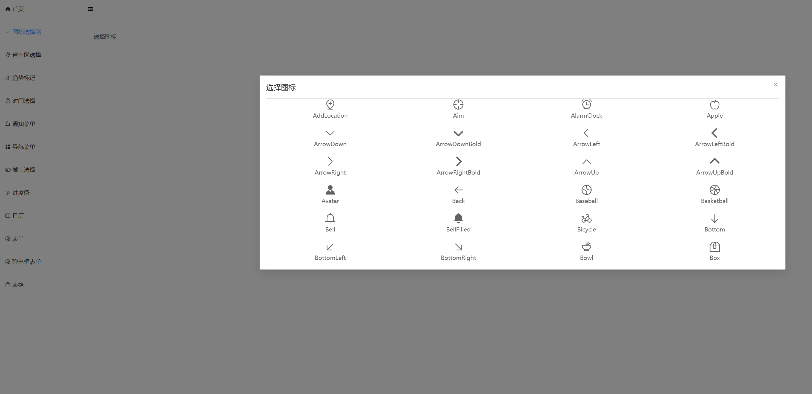
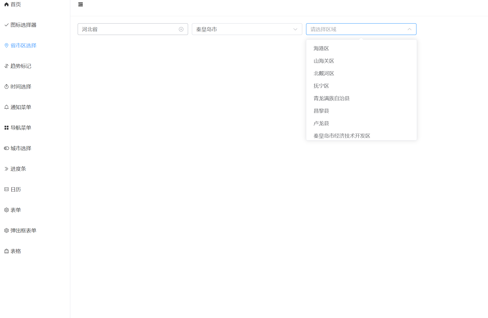
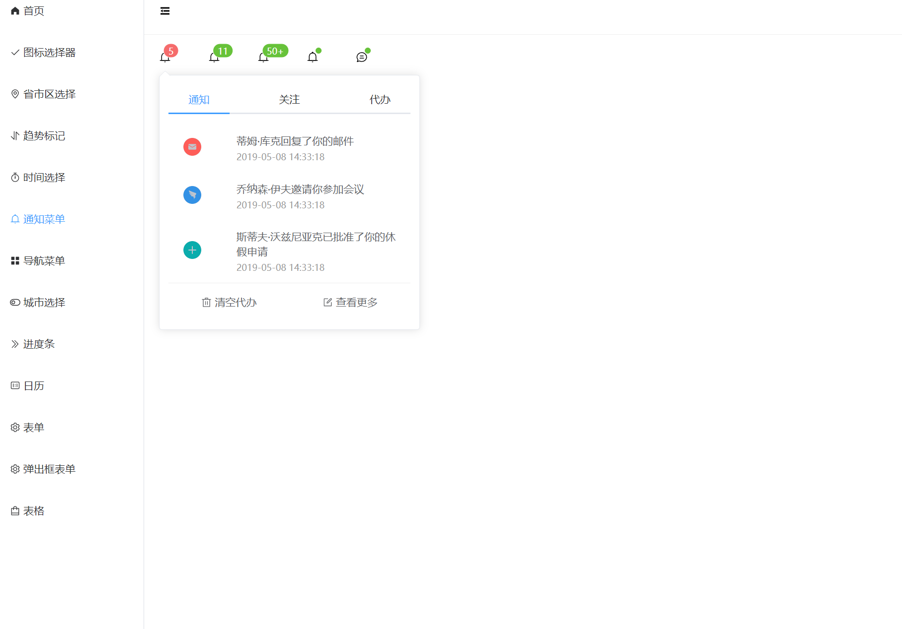
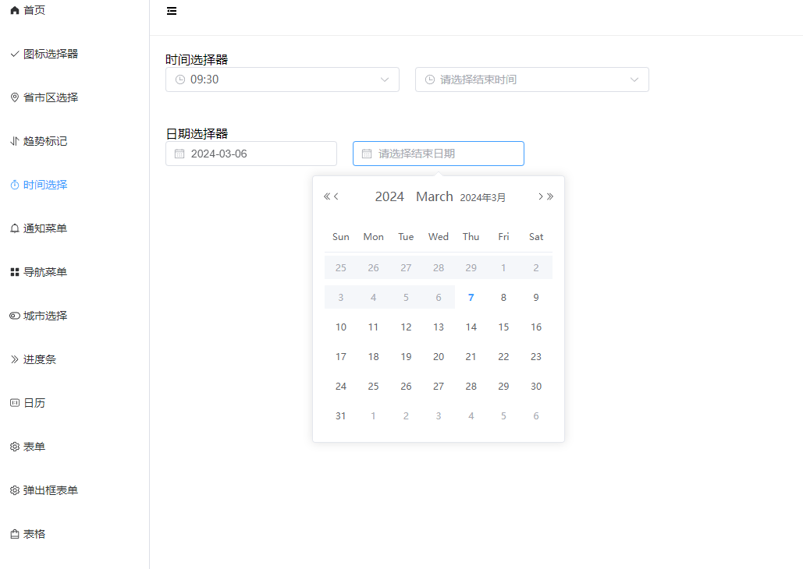
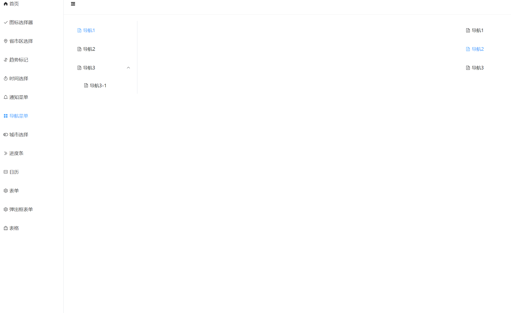
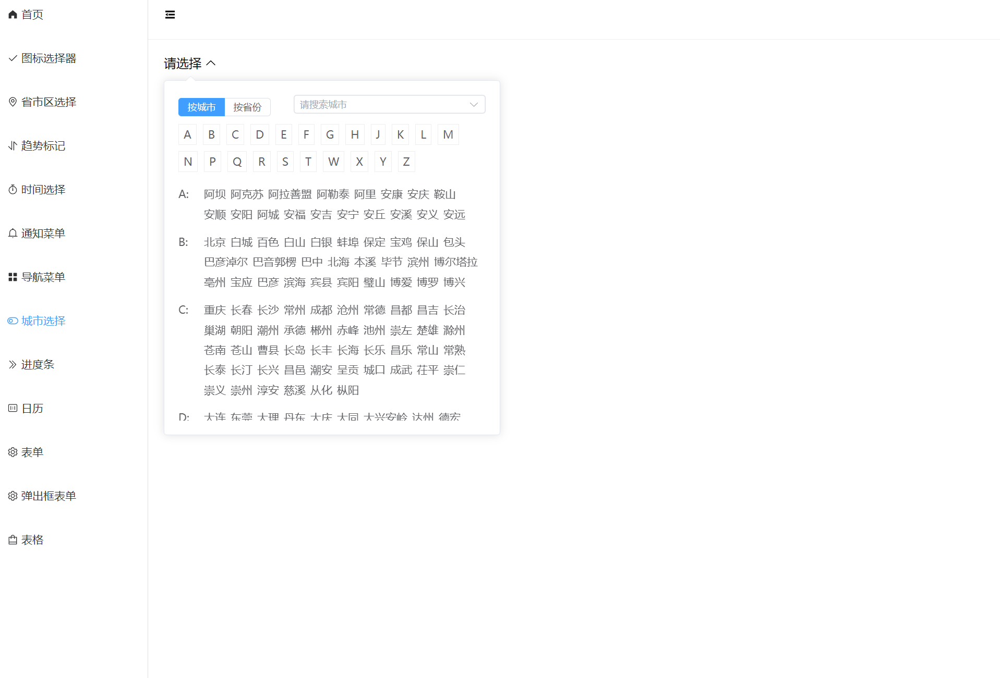
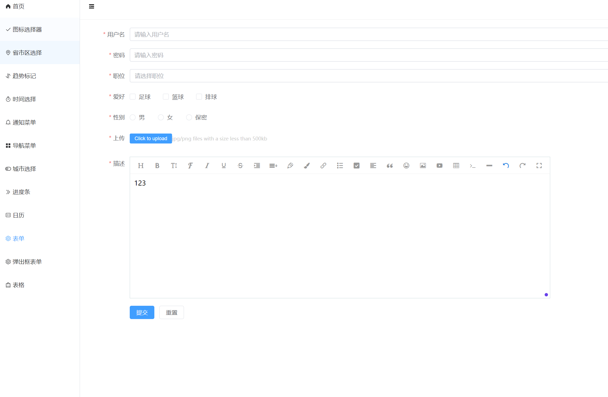
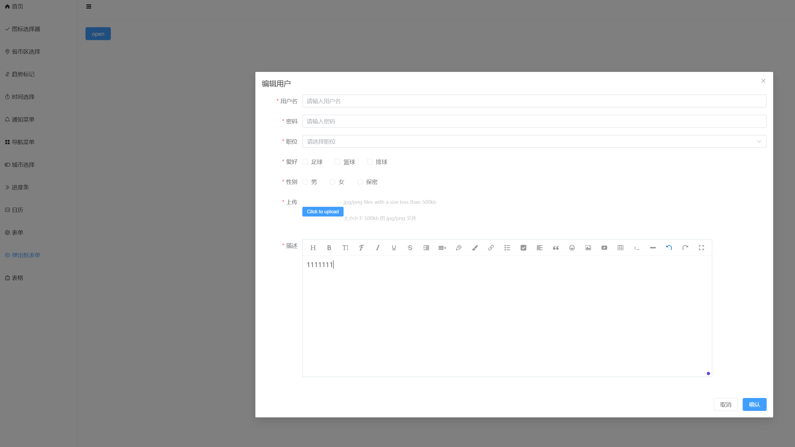
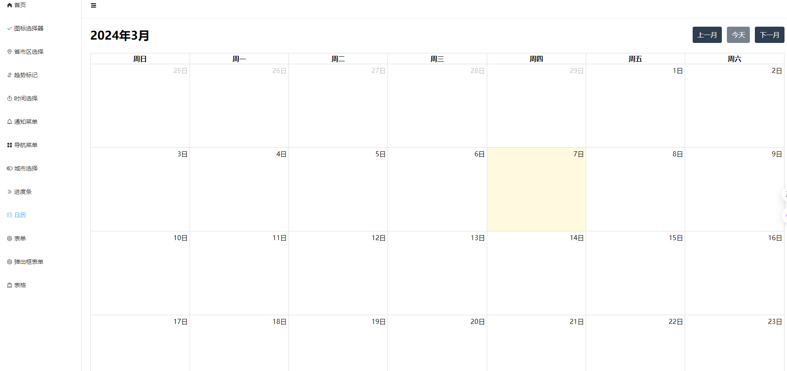
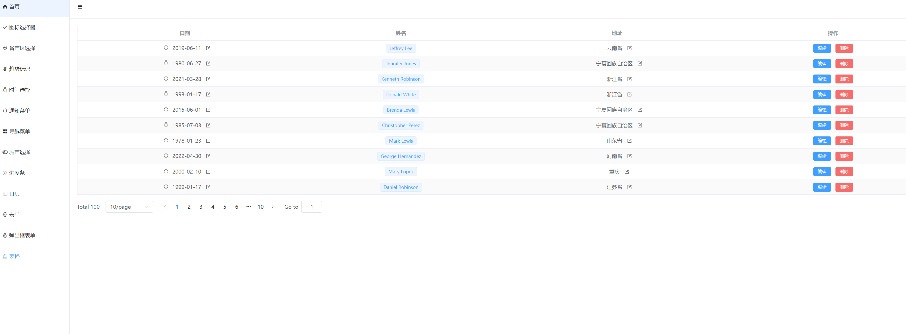

# 基于Vue3+Vite+TS，二次封装element-plus业务组件
基于vue3+vite+ts二次封装element-plus业务组件，实现业务组件的封装、复用、组件库的搭建,并实现组件的按需加载，提高开发效率。包含了图标选择器，趋势标记，通知菜单等基础组件，以及表格、表单、弹窗、分页等业务组件。表单还使用了vee-validate进行表单验证,并且支持markdown输入，文件上传。
## 演示地址

### [点击预览](https://youwei997.github.io/vue3-ts-elementplus-components-web/#/)

## 一、技术栈

该项目主要使用 `Vue`搭配`element-plus`采用组件化的方式开发完成,此外项目中陆续使用有

- vue3全家桶
- lodash
- element-plus
- axios
- sass
- vite
- mockjs

## 二、运行效果截图

#### 1 图标选择器

#### 2 省市区选择器

#### 3 通知菜单

#### 4 时间选择器

#### 5 导航菜单

#### 6 城市选择

#### 7 表单

#### 8 弹出表单

#### 9 日历

#### 10 表格

## 组件打包和上传到npm
1. 运行 `npm run lib`, 会生成新的lib文件夹
2. 将lib-temp下的文件复制到lib文件夹
3. 将lib-temp下的index.d.ts 复制到lib 每个组件文件夹下
4. cd到lib文件夹下， 修改package的版本号
5. 执行`npm login`， 然后执行`npm publish`

## 注意
部署github page 需要指定base路径， 可以用package里的`build:base` 打包